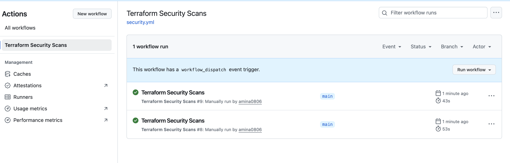
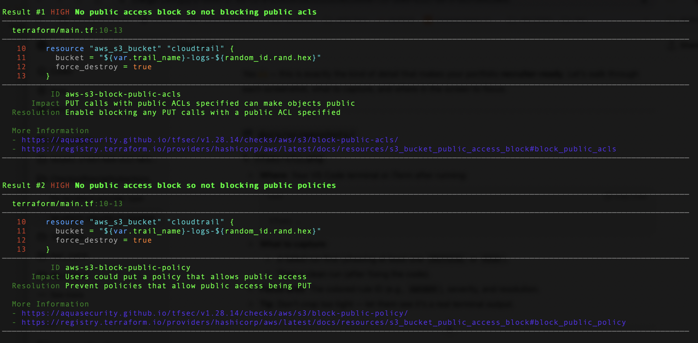
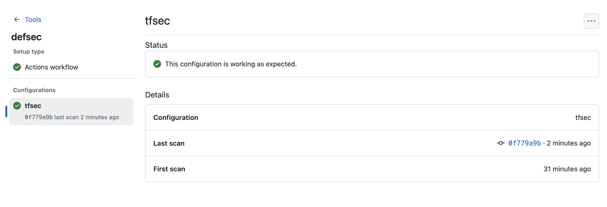
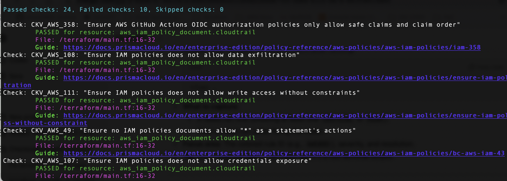
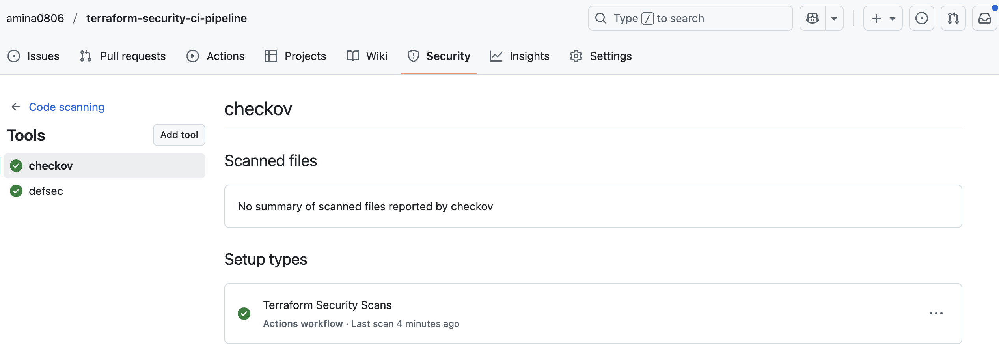
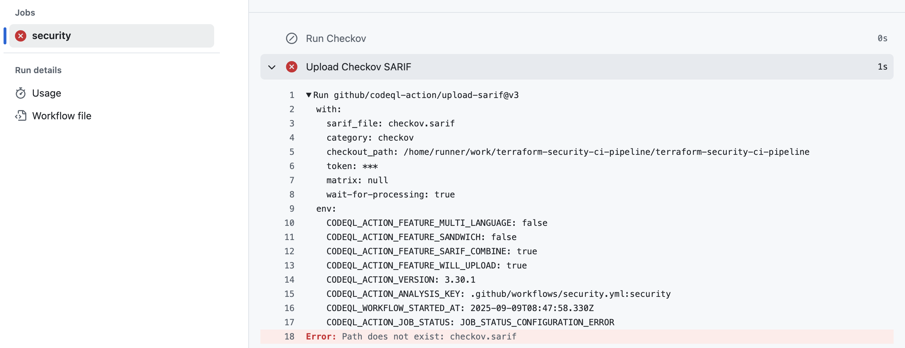
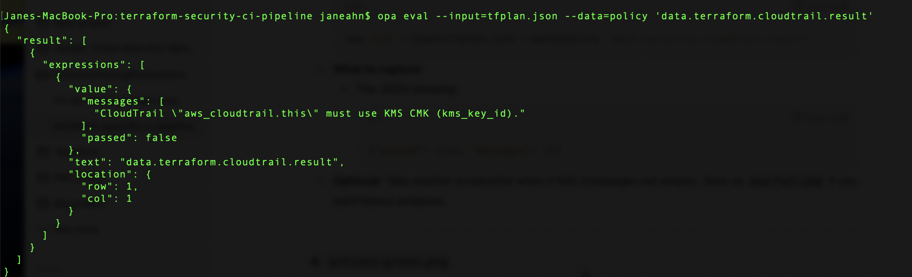
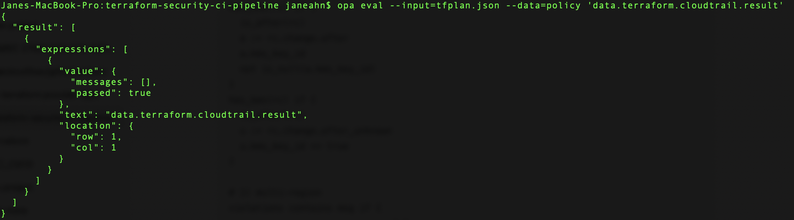

# Terraform Security CI Pipeline — tfsec + Checkov + OPA

This project demonstrates how to integrate **Infrastructure-as-Code (IaC) security scans** directly into GitHub Actions.
It enforces security best practices for Terraform using:

- **tfsec** — static analysis for Terraform
- **Checkov** — policy-as-code scanner for cloud misconfigurations
- **OPA/Rego** — custom guardrails for Terraform plans

Code scanning results are automatically uploaded to the **GitHub Security tab** as SARIF reports, giving centralized visibility for IaC misconfigurations.

---

## What this proves

- I can integrate **IaC security scanning tools** into CI/CD pipelines.
- I can **detect and surface Terraform security issues** (e.g., S3 public access, IAM wildcard policies).
- I can **write custom OPA policies** to enforce specific security/compliance requirements.
- Results are uploaded as **SARIF reports** → visible in GitHub **Security → Code scanning**.
- This workflow demonstrates **DevSecOps maturity** by embedding compliance checks before deployment.

---

## Screenshots

| Proof | Screenshot |
|-------|------------|
| ✅ GitHub Actions workflow success (green) |  |
| ✅ tfsec CLI scan results (fail + pass examples) |  |
| ✅ tfsec SARIF uploaded in Security tab |  |
| ✅ Checkov CLI scan results (pass/fail mix) |  |
| ✅ Checkov SARIF uploaded in Security tab |  |
| ✅ Actions failure example (Checkov SARIF missing) |  |
| ✅ OPA policy fail (CloudTrail missing KMS) |  |
| ✅ OPA policy pass (CloudTrail with KMS) |  |

---

## Compliance Mapping

Each tool maps to industry controls:

- **tfsec / Checkov**
  - ISO/IEC 27001:2022 — *A.8.16 Monitoring activities*, *A.8.20 Cryptography*, *A.8.23 Information security in cloud services*
  - CIS AWS Foundations Benchmark — *Logging enabled*, *IAM least privilege*, *S3 encryption/public access block*
  - Saudi NCA ECC — *CC-06 Compliance checks*, *IM-02 Logging and monitoring*
  - UAE NESA IAS — *Control 2.2.1 (Audit logging)*, *Control 2.5.2 (Access control)*

- **OPA (Custom Rego Guardrails)**
  - ISO/IEC 27001:2022 — *5.35 Technical compliance review*, *8.28 Secure coding*
  - Saudi NCA ECC — *DEV-01 Secure development*
  - Demonstrates ability to **author & enforce custom compliance checks** beyond built-in scanners.

---

## How it works

1. **Push or manual trigger** runs `security.yml` workflow.
2. **tfsec** runs → generates SARIF → uploaded to GitHub Code Scanning.
3. **Checkov** runs → generates SARIF → uploaded to GitHub Code Scanning.
4. **OPA** runs locally to validate Terraform plans before apply.

This ensures that **every Terraform change is checked for compliance and security misconfigurations before merge/deploy**.

---

## Next Steps

- Broaden **OPA/Rego policy** coverage to include IAM, S3, KMS, and GuardDuty guardrails.
- Strengthen compliance mapping by linking policy checks directly to **ISO 27001, CIS, and NCA/NESA controls**.
- Demonstrate integration with **AWS Security Hub** or **SonarQube** for **enterprise-scale vulnerability management** and **reporting**.

---
